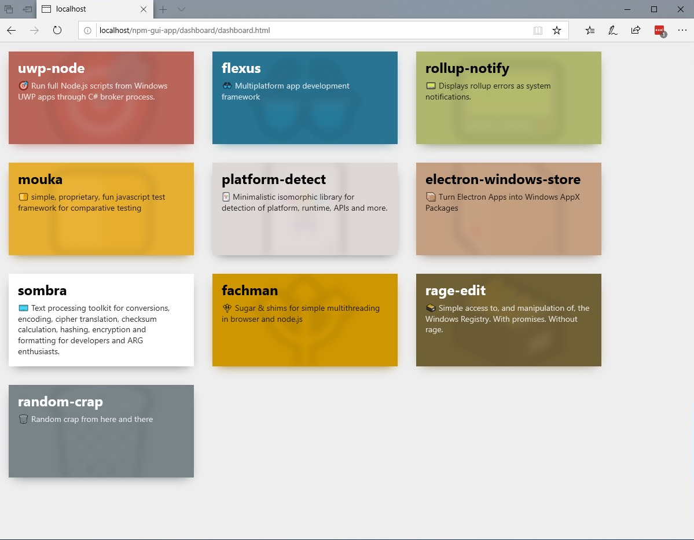

## Concept of an NPM & GitHub App for module developers

## What is this repo?

Collection of ideas and very very messy code & hacky code written late at night to make a proof of concept.

Now that we have that out of the way... This is an idea of what an app for library and NPM modules developers could be like.

It's a passion project that I'll get back to from time to time and experiment with. If it ever comes out it will be a UWP Windows Store App (but portable to Electron) that would support managing, auditing and publishing NPM modules to the registry and to GitHub + a stripped down PWA version that's basically just an overview of NPM account.

## Some concepts

*Slightly ugly and unfinished mashup of Windows UWP app displaying details of a Node module, its package.json and dependencies installes in node_modules*

  

*Screenshot of an actual running code of user's modules dashboard that can be found in ./dashboard/.*

  

